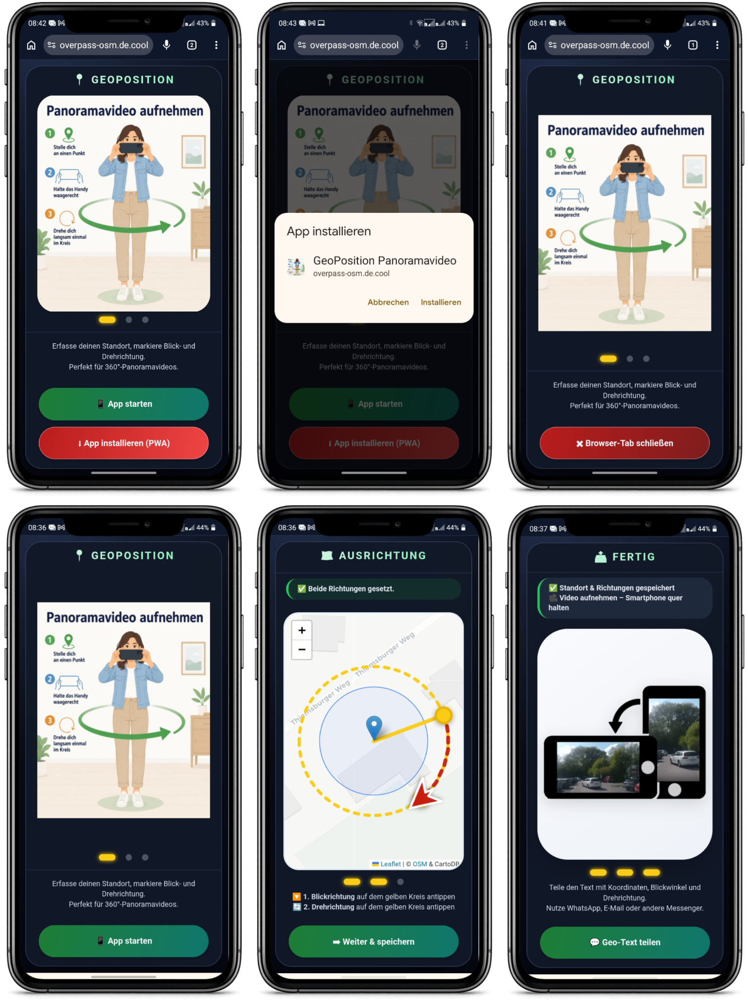
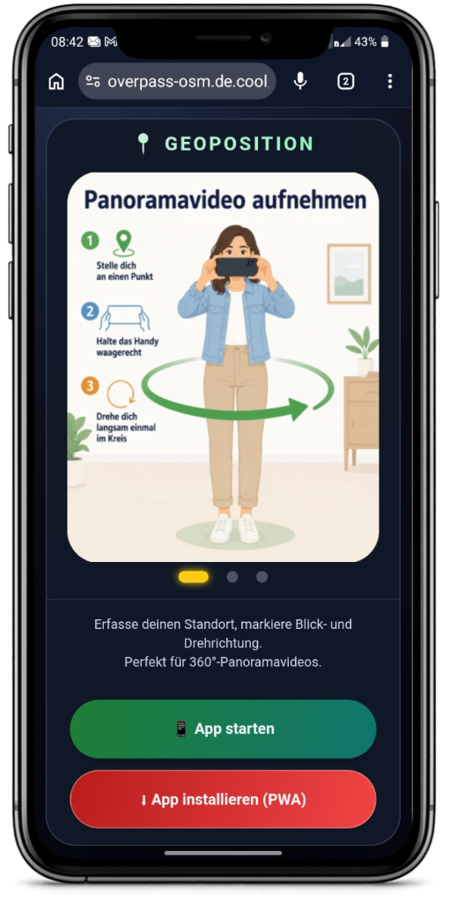
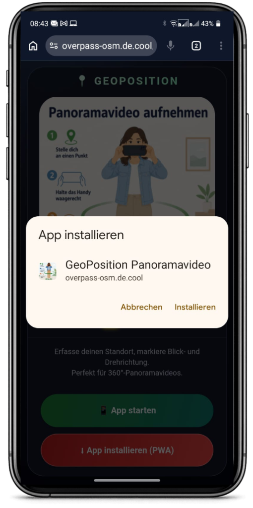
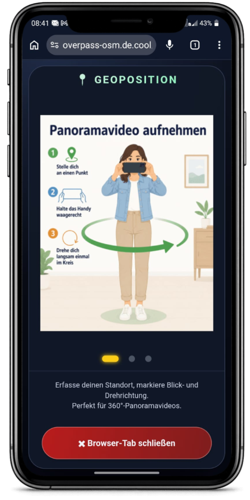
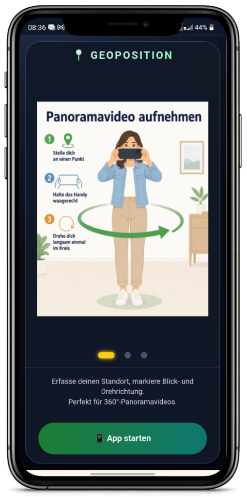
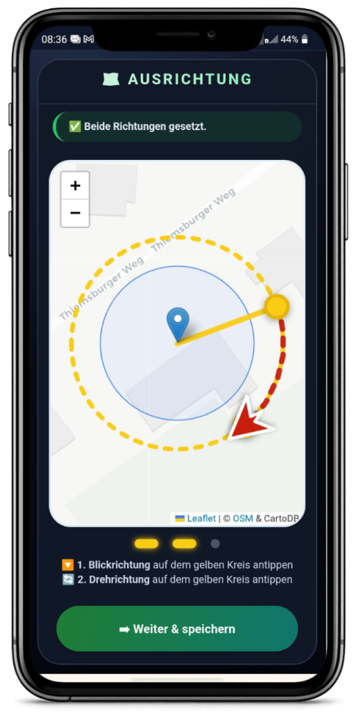
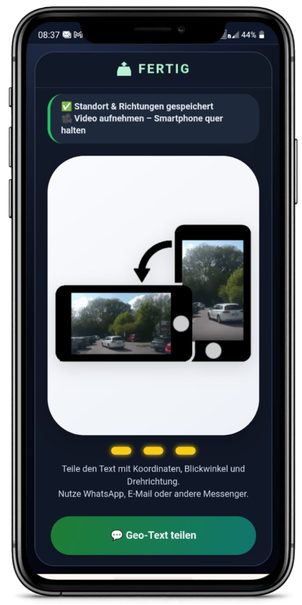

# GeoPosition

**GeoPosition** ist eine kleine PWA zum Erfassen eines Standorts für Panoramavideos.
Die App speichert **Standort, Blickrichtung und Drehrichtung** und erzeugt daraus einen **teilbaren Geo-Text** mit Link zum **FotoGeoTool**.

Nach dem Teilen des Geo-Textes wird das **Panoramavideo separat aufgenommen und ebenfalls versendet**.
```diff
- Das FotoGeoTool hat keine Kamera-Aufnahmefunktion!
```

## Funktionen

- Standort per GPS erfassen
- Blickrichtung auf der Karte markieren
- Drehrichtung auf dem gelben Kreis markieren
- Geo-Text mit Koordinaten, Blickwinkel und Drehrichtung teilen
- Link-Übergabe an das **FotoGeoTool**
- Installation als **PWA** auf dem Handy
- Browser-Hinweis nach Installation

## Übersicht



## Screenshots

<table>
  <tr>
    <td width="50%" valign="top">
      <h3>1. Startseite mit Installationsbutton</h3>
      
    </td>
    <td width="50%" valign="top">
      <h3>2. Installationsdialog</h3>
      
    </td>
  </tr>
  <tr>
    <td width="50%" valign="top">
      <h3>3. Browser-Tab nach Installation schließen</h3>
      
    </td>
    <td width="50%" valign="top">
      <h3>4. Startseite der App</h3>
      
    </td>
  </tr>
  <tr>
    <td width="50%" valign="top">
      <h3>5. Ausrichtung auf der Karte setzen</h3>
      
    </td>
    <td width="50%" valign="top">
      <h3>6. Fertig-Seite und Geo-Text teilen</h3>
      
    </td>
  </tr>
</table>


## Ablauf

1. **App öffnen**
2. Optional als **PWA installieren**
3. **Standort** automatisch erfassen lassen
4. **Blickrichtung** auf dem gelben Kreis antippen
5. **Drehrichtung** auf dem gelben Kreis antippen
6. **Geo-Text teilen**
7. Danach das **Panoramavideo aufnehmen**
8. Das **Video ebenfalls versenden**

## Projektstruktur

```text
geo-position/
├── index.html
├── manifest.webmanifest
├── sw.js
├── version.json
├── pwa-daten-loeschen.html
├── .htaccess
├── README.md
└── assets/
```
## 
- Senden Sie zuerst die Geodaten per WhatsApp.
- Nehmen Sie danach das Panoramavideo mit der Kamera-App Ihres Handys auf und senden Sie es ebenfalls per WhatsApp.
- Bitte fügen Sie eine kurze Beschreibung hinzu, damit später alle Informationen zur Bearbeitung vorhanden sind.
      -- Schreiben Sie kurz dazu:
      -- Was ist an diesem Ort besonders?
      -- Was ist auf dem Panorama zu sehen?
      -- Wo wurde das Video aufgenommen?
      -- Was ist an diesem Ort besonders?
      -- Was soll man auf dem Panorama sehen?

Diese Beschreibung hilft später bei der Bearbeitung, zum Beispiel um einen passenden Alt-Text für eine Webseite oder eine Karte zu erstellen.      

**Achtung:** Diese App hat keine eigene Aufnahmefunktion.
```
## Wichtige Hinweise

- Das FotoGeoTool liegt unter:
  `https://overpass-osm.de.cool/FotoGeoTool/index.html`
- Für Messenger-Vorschauen kann bei `og:image:type` absichtlich ein unpassender MIME-Type verwendet werden, damit WhatsApp den Dateikopf der Bilddatei selbst prüft.
- Nach Änderungen an der PWA sollte der Browser-Cache bzw. der Service Worker gegebenenfalls geleert werden.

## Lizenz

CC BY 4.0  
Autor: **Lutz Müller**
